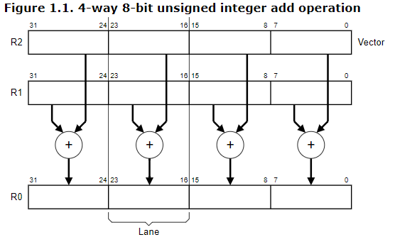
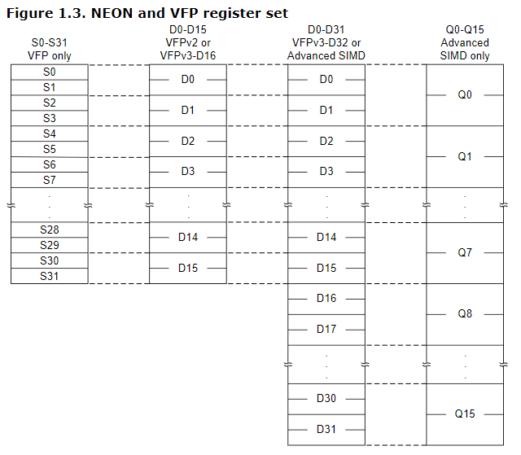

## NEON优化

NEON是用来实现ARM芯片上计算加速的一套系统。以下介绍NEON的基本知识和使用实例。

> 喜欢啃英文手册的同学可以直接跳转 [NEON在线手册](http://infocenter.arm.com/help/index.jsp?topic=/com.arm.doc.dht0002a/ch01s03s02.html) 

## 什么是SIMD

NEON是一种加速技术的实现，而这个技术就是SIMD。
SIMD可通过并行控制，实现对寄存器的并行操作，比如对32bit寄存器中的4个8bit数据进行4条指令并行的运算。现代高级编程语言不能做到如此精细的控制。



上图描述了对32bit寄存器中4个8bit数并行操作的过程。R2和R1分别存储4x8bit数据，通过并行执行4个Lane（运算通道）在一个计算周期中完成矩阵乘法，结果存在R0中。

> R0[0] = R1[0] x R2[0]

> R0[1] = R1[1] x R2[1]

> R0[2] = R1[2] x R2[2]

> R0[3] = R1[3] x R2[3]

## 什么是NEON

对SIMD技术的实现，就是NEON。通过C函数的方式，对并行操作进行封装。

## 为什么需要在NEON中实现并行运算

SIMD的寄存器内的并行优于现代编程语言多线程并行操作的原因在于数据加速速度与CPU运算速度的差异。
现代CPU的运算速度远超过内存加载的速度，Core i7 CPU读取离他最近（不论是物理还是逻辑上，都是最近）的L1缓存仍需要约4个CPU周期，而读取L2缓存或更远的内存的时间成本更加昂贵。

### CPU读取内存的过程

> 喜欢啃英文博客的同学可直接跳转 [How L1 and L2 CPU Caches Work, and Why They’re an Essential Part of Modern Chips](https://www.extremetech.com/extreme/188776-how-l1-and-l2-cpu-caches-work-and-why-theyre-an-essential-part-of-modern-chips)

CPU读取L1缓存时，就像人们挑选自己的扑克牌，必须每个牌都看一遍才能正确拾取。

>> // TODO 没填完的坑

## NEON的硬件基础

NEON实现的SIMD技术，依赖一套NEON寄存器，这套寄存器与L1 cache L2 cache相同，量小质优，读写速度极快。下面列举ARMv7芯片中的cache信息。

| 名称 | 编号 | 大小 |
| --- | --- | --- |
| L1 Cache | R0 - R15 | 16 x 32bit |
| NEON寄存器 | Q0 - Q15 或 D0 - D21 | 16 x 128bit 或 32 x 64bit |
| VFP寄存器（浮点运算）| S0 - S15 | 16 x 32bit |

表中NEON寄存器是NEON函数调用的主要寄存器。ARMv7有16个128bit寄存器，每个128bit寄存器可拆分成2 x 64bit使用。



## NEON的数据结构

NEON包含的数据类型作为运算时的计算单位，包含：
* 8bit、16bit、32bit、64bit的有符号无符号整数
* 32bit单精度浮点数
* 8bit、16bit的多项式，用于无进位的乘法

在NEON的函数中，这些数据类型不会直接作为运算的单位，会组合成固定长度的数组。这些数组是NEON运算的基本单位。

```c
// e.g.
int8x8_t
uint8x8_t
float32x4_t
```

数组会组合成结构体，举个例子：

```c
// e.g.
typedef struct int8x8x2_t  
{  
   int8x8_t val[2];  
} int8x8x2_t;
```

## NEON的函数形式

NEON的函数凸显其并行运算的本质，每个函数都将数组中的数据并行执行相同的运算，将结果存储在数组中。以两个8x8bit的数组做 [点积](https://zh.wikipedia.org/wiki/%E7%82%B9%E7%A7%AF) 为例。

```c
// ri = ai * bi
int16x8_t vmull_s8 (int8x8_t __a, int8x8_t __b);  
```

这里开头的“v”是固定的开头
// TODO 函数命名

## NEON的编译

// TODO neon编译

## NEON优化实例

// TODO NEON优化C运算的代码和讲解，及实际得并行运算过程